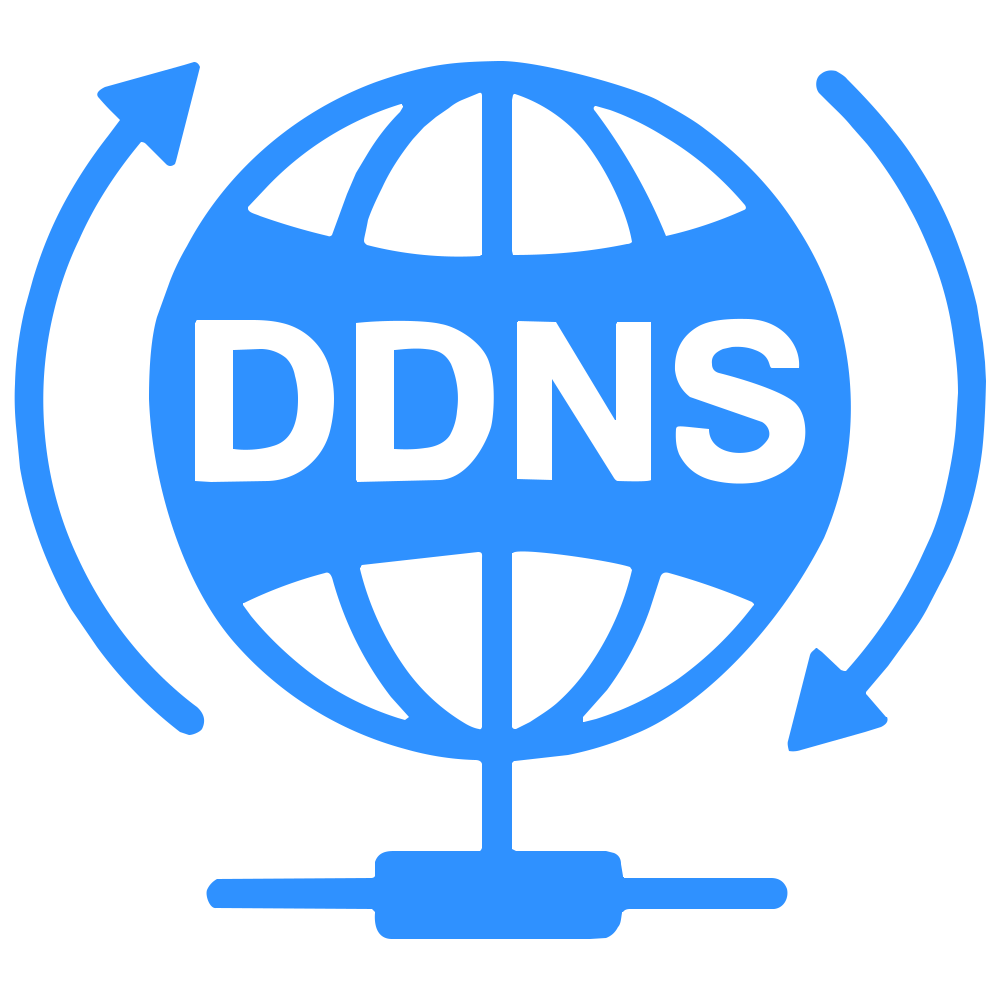

# [](https://ddns.newfuture.cc) [DDNS](https://github.com/NewFuture/DDNS)

> 自动更新 DNS 解析 到本机 IP 地址，支持 IPv4 和 IPv6，本地（内网）IP 和公网 IP。
> 代理模式，支持自动创建 DNS 记录。

[](https://github.com/NewFuture/DDNS/releases/latest)
[](https://pypi.org/project/ddns/)
[](https://hub.docker.com/r/newfuture/ddns)
[](https://github.com/NewFuture/DDNS/actions/workflows/build.yml)
[](https://github.com/NewFuture/DDNS/actions/workflows/publish.yml)

---

## Features

- 兼容和跨平台:
  - [Docker (@NN708)](https://hub.docker.com/r/newfuture/ddns) [](https://hub.docker.com/r/newfuture/ddns)[](https://hub.docker.com/r/newfuture/ddns)
  - [PIP 安装 (兼容Python2)](https://pypi.org/project/ddns/)  
  - [二进制文件](https://github.com/NewFuture/DDNS/releases/latest) 

- 域名支持:
  - 多个域名支持
  - 多级域名解析
  - 自动创建新 DNS 记录
- IP 类型:
  - 内网 IPv4 / IPv6
  - 公网 IPv4 / IPv6 (支持自定义 API)
  - 自定义命令（shell）
  - 正则选取支持 (@rufengsuixing)
- 网络代理:
  - http 代理支持
  - 多代理自动切换
- 服务商支持:
  - [DNSPOD](https://www.dnspod.cn/)
  - [阿里 DNS](http://www.alidns.com/)
  - [DNS.COM](https://www.dns.com/) (@loftor-git)
  - [DNSPOD 国际版](https://www.dnspod.com/)
  - [CloudFlare](https://www.cloudflare.com/) (@tongyifan)
  - [HE.net](https://dns.he.net/) (@NN708) (不支持自动创建记录)
  - [华为云](https://huaweicloud.com/) (@cybmp3)
- 其他:
  - 可设置定时任务
  - TTL 配置支持
  - 本地文件缓存（减少 API 请求）
  - 地址变更时触发自定义回调 API（与 DDNS 功能互斥）

## 使用

### ① 安装

根据需要选择一种方式：`二进制`版、`pip`版、`源码`运行，或者 `Docker`。

推荐 Docker 版，兼容性最佳，体积小，性能优化。

- #### pip 安装（需要 pip 或 easy_install）

  1. 安装 ddns: `pip install ddns` 或 `easy_install ddns`
  2. 运行: `ddns`

- #### 二进制版（单文件，无需 python）

  - Windows [ddns.exe](https://github.com/NewFuture/DDNS/releases/latest)
  - Linux（仅 Ubuntu 测试） [ddns](https://github.com/NewFuture/DDNS/releases/latest)
  - Mac OSX [ddns-mac](https://github.com/NewFuture/DDNS/releases/latest)

- #### 源码运行（无任何依赖，需 python 环境）

  1. clone 或者 [下载此仓库](https://github.com/NewFuture/DDNS/archive/master.zip) 并解压
  2. 运行 ./run.py（windows 双击 `run.bat` 或者运行 `python run.py`）

- #### Docker（需要安装 Docker）

  - 使用环境变量：

    ```sh
    docker run -d \
      -e DDNS_DNS=dnspod \
      -e DDNS_ID=12345 \
      -e DDNS_TOKEN=mytokenkey \
      -e DDNS_IPV4=ddns.newfuture.cc \
      -e DDNS_IPV6=ddns.newfuture.cc \
      --network host \
      newfuture/ddns
    ```

  - 使用配置文件（docker 工作目录 `/ddns/`，默认配置位置 `/ddns/config.json`）：

    ```sh
    docker run -d \
      -v /local/config/path/:/ddns/ \
      --network host \
      newfuture/ddns
    ```

### ② 快速配置

1. 申请 api `token`，填写到对应的 `id` 和 `token` 字段:

   - [DNSPOD(国内版)创建 token](https://support.dnspod.cn/Kb/showarticle/tsid/227/)
   - [阿里云 accesskey](https://help.aliyun.com/document_detail/87745.htm)
   - [DNS.COM API Key/Secret](https://www.dns.com/member/apiSet)
   - [DNSPOD(国际版)](https://www.dnspod.com/docs/info.html#get-the-user-token)
   - [CloudFlare API Key](https://support.cloudflare.com/hc/en-us/articles/200167836-Where-do-I-find-my-Cloudflare-API-key-)（除了 `email + API KEY`，也可使用 `Token`，需要列出 Zone 权限）
   - [HE.net DDNS 文档](https://dns.he.net/docs.html)（仅需将设置的密码填入 `token` 字段，`id` 字段可留空）
   - [华为 APIKEY 申请](https://console.huaweicloud.com/iam/)（点左边访问密钥，然后点新增访问密钥）
   - 自定义回调的参数填写方式请查看下方的自定义回调配置说明

2. 修改配置文件，`ipv4` 和 `ipv6` 字段，为待更新的域名，详细参照配置说明

## 详细配置

所有字段可通过三种方式进行配置

1. 命令行参数 `ddns --key=value`（`ddns -h` 查看详情），优先级最高
2. JSON 配置文件（值为 null 认为是有效值，会覆盖环境变量的设置，如果没有对应的 key 则会尝试使用环境变量）
3. 环境变量 DDNS_ 前缀加上 key 全大写或者全小写，点转下划线（`${ddns_id}` 或 `${DDNS_ID}`，`${DDNS_LOG_LEVEL}`）

<details open>
<summary markdown="span">config.json 配置文件</summary>

- 首次运行会自动生成一个模板配置文件
- 可以使用 `-c` 使用指定的配置文件（默认读取当前目录的 config.json）
- 推荐使用 vscode 等支持 JsonSchema 的编辑器编辑配置文件

```bash
ddns -c path/to/config.json
# 或者源码运行
python run.py -c /path/to/config.json
```

#### 配置参数表

|  key     |        type        | required |   default   |    description    | tips                                                                                                        |
| :------: | :----------------: | :------: | :---------: | :---------------: | ----------------------------------------------------------------------------------------------------------- |
|   id     |       string       |    √     |     无      |    api 访问 ID    | Cloudflare 为邮箱（使用 Token 时留空）<br>HE.net 可留空<br>华为云为 Access Key ID (AK)                     |
|  token   |       string       |    √     |     无      |  api 授权 token   | 部分平台叫 secret key，**反馈粘贴时删除**                                                                   |
|  dns     |       string       |    No    | `"dnspod"`  |    dns 服务商     | 阿里 DNS 为 `alidns`，Cloudflare 为 `cloudflare`，dns.com 为 `dnscom`，DNSPOD 国内为 `dnspod`，DNSPOD 国际为 `dnspod_com`，HE.net 为 `he`，华为云为 `huaweidns`，自定义回调为 `callback` |
|  ipv4    |       array        |    No    |    `[]`     |   ipv4 域名列表   | 为 `[]` 时，不会获取和更新 IPv4 地址                                                                        |
|  ipv6    |       array        |    No    |    `[]`     |   ipv6 域名列表   | 为 `[]` 时，不会获取和更新 IPv6 地址                                                                        |
| index4   | string\|int\|array |    No    | `"default"` |   ipv4 获取方式   | 可设置 `网卡`、`内网`、`公网`、`正则` 等方式                                                                |
| index6   | string\|int\|array |    No    | `"default"` |   ipv6 获取方式   | 可设置 `网卡`、`内网`、`公网`、`正则` 等方式                                                                |
|  ttl     |       number       |    No    |   `null`    | DNS 解析 TTL 时间 | 不设置采用 DNS 默认策略                                                                                     |
|  proxy   |       string\|array       |    No    |     无      | http 代理 `;` 分割 | 多代理逐个尝试直到成功，`DIRECT` 为直连                                                                     |
| ~~debug~~|        bool        |    No    |   `false`   |   是否开启调试    | v4 中弃用，请改用 log.level=DEBUG                                                                           |
|  cache   |    string\|bool    |    No    |   `true`    |   是否缓存记录    | 正常情况打开避免频繁更新，默认位置为临时目录下 `ddns.cache`，也可以指定一个具体路径                          |
|  log     | {"level":string,"file":string} | No | `null` | 日志配置（可选） | 日志配置，日志级别和路径（默认命令行），例如：`{ "level": "DEBUG", "file": "dns.log" }`                    |

#### index4 和 index6 参数说明

- 数字（`0`，`1`，`2`，`3`等）：第 i 个网卡 ip
- 字符串 `"default"`（或者无此项）：系统访问外网默认 IP
- 字符串 `"public"`：使用公网 ip（使用公网 API 查询，url 的简化模式）
- 字符串 `"url:xxx"`：打开 URL `xxx`（如：`"url:http://ip.sb"`），从返回的数据提取 IP 地址
- 字符串 `"regex:xxx"` 正则表达（如 `"regex:192.*"`）：提取 `ifconfig`/`ipconfig` 中与之匹配的首个 IP 地址，**注意 json 转义**（`\`要写成`\\`）
  - `"192.*"` 表示 192 开头的所有 ip（注意 `regex:` 不可省略）
  - 如果想匹配 `10.00.xxxx` 应该写成 `"regex:10\\.00\\..*"`（`"\\"` json 转义成 `\`）
- 字符串 `"cmd:xxxx"`：执行命令 `xxxx` 的 stdout 输出结果作为目标 IP
- 字符串 `"shell:xxx"`：使用系统 shell 运行 `xxx`，并把结果 stdout 作为目标 IP
- `false`：强制禁止更新 ipv4 或 ipv6 的 DNS 解析
- 列表：依次执行列表中的 index 规则，并将最先获得的结果作为目标 IP
  - 例如 `["public", "regex:172\\..*"]` 将先查询公网 API，未获取到 IP 后再从本地寻找 172 开头的 IP

#### 自定义回调配置说明

- `id` 字段填写回调地址，以 HTTP 或 HTTPS 开头，推荐采用 HTTPS 方式的回调 API ，当 `token` 字段非空且 URL 参数包含下表所示的常量字符串时，会自动替换为实际内容。
- `token` 字段为 POST 参数，本字段为空或不存在则使用 GET 方式发起回调，回调参数采用 JSON 格式编码，当 JSON 的首层参数值包含下表所示的常量字符串时，会自动替换为实际内容。

| 常量名称          | 常量内容               | 说明      |
| ---------------- | ---------------------- | -------- |
| `__DOMAIN__`     | DDNS 域名              |          |
| `__RECORDTYPE__` | DDNS 记录类型           |          |
| `__TTL__`        | DDNS TTL               |          |
| `__TIMESTAMP__`  | 请求发起时间戳          | 包含小数 |
| `__IP__`         | 获取的对应类型的 IP 地址 |          |

#### 配置示例

```json
{
  "$schema": "https://ddns.newfuture.cc/schema/v4.0.json",
  "id": "12345",
  "token": "mytokenkey",
  "dns": "dnspod 或 dnspod_com 或 alidns 或 dnscom 或 cloudflare 或 he 或 huaweidns 或 callback",
  "ipv4": ["ddns.newfuture.cc", "ipv4.ddns.newfuture.cc"],
  "ipv6": ["ddns.newfuture.cc", "ipv6.ddns.newfuture.cc"],
  "index4": 0,
  "index6": "public",
  "ttl": 600,
  "proxy": "127.0.0.1:1080;DIRECT",
  "log": {
    "level": "DEBUG",
    "file": "dns.log"
  }
}
```
</details>

## 定时任务

<details>
<summary markdown="span">可以通过脚本设置定时任务（默认每 5 分钟检查一次 IP，自动更新）</summary>

#### Windows

- [推荐] 以系统身份运行，右键“以管理员身份运行”`task.bat`（或者在管理员命令行中运行）
- 以当前用户身份运行定时任务，双击或运行 `task.bat`（执行时会闪黑框）

#### Linux

- 使用 init.d 和 crontab:
  ```bash
  sudo ./task.sh
  ```
- 使用 systemd:
  ```bash
  安装:
  sudo ./systemd.sh install
  卸载:
  sudo ./systemd.sh uninstall
  ```

  该脚本安装的文件符合 [Filesystem Hierarchy Standard (FHS)](https://en.wikipedia.org/wiki/Filesystem_Hierarchy_Standard)：
  可执行文件所在目录为 `/usr/share/DDNS`
  配置文件所在目录为 `/etc/DDNS`

#### Docker

Docker 镜像在无额外参数的情况下，已默认启用每 5 分钟执行一次的定时任务

</details>

## FAQ

<details>
<summary markdown="span">Windows Server [SSL: CERTIFICATE_VERIFY_FAILED]</summary>

> Windows Server 默认安全策略会禁止任何未添加的信任 SSL 证书，可手动添加一下对应的证书 [#56](https://github.com/NewFuture/DDNS/issues/56#issuecomment-487371078)

使用系统自带的 IE 浏览器访问一次对应的 API 即可

- alidns 打开: <https://alidns.aliyuncs.com>
- cloudflare 打开: <https://api.cloudflare.com>
- dns.com 打开: <https://www.dns.com>
- dnspod.cn 打开: <https://dnsapi.cn>
- dnspod 国际版: <https://api.dnspod.com>
- 华为 DNS <https://dns.myhuaweicloud.com>
</details>

<details>
<summary markdown="span">问题排查反馈</summary>

1. 先确认排查是否是系统/网络环境问题
2. 在 [issues](https://github.com/NewFuture/DDNS/issues) 中搜索是否有类似问题
3. 前两者均无法解决或者确定是 bug，[在此新建 issue](https://github.com/NewFuture/DDNS/issues/new)
   - [ ] 开启 debug 配置
   - [ ] 附上这些内容 **运行版本和方式**、**系统环境**、**出错日志**、**去掉 id/token** 的配置文件
   - [ ] 源码运行注明使用的 python 环境

</details>