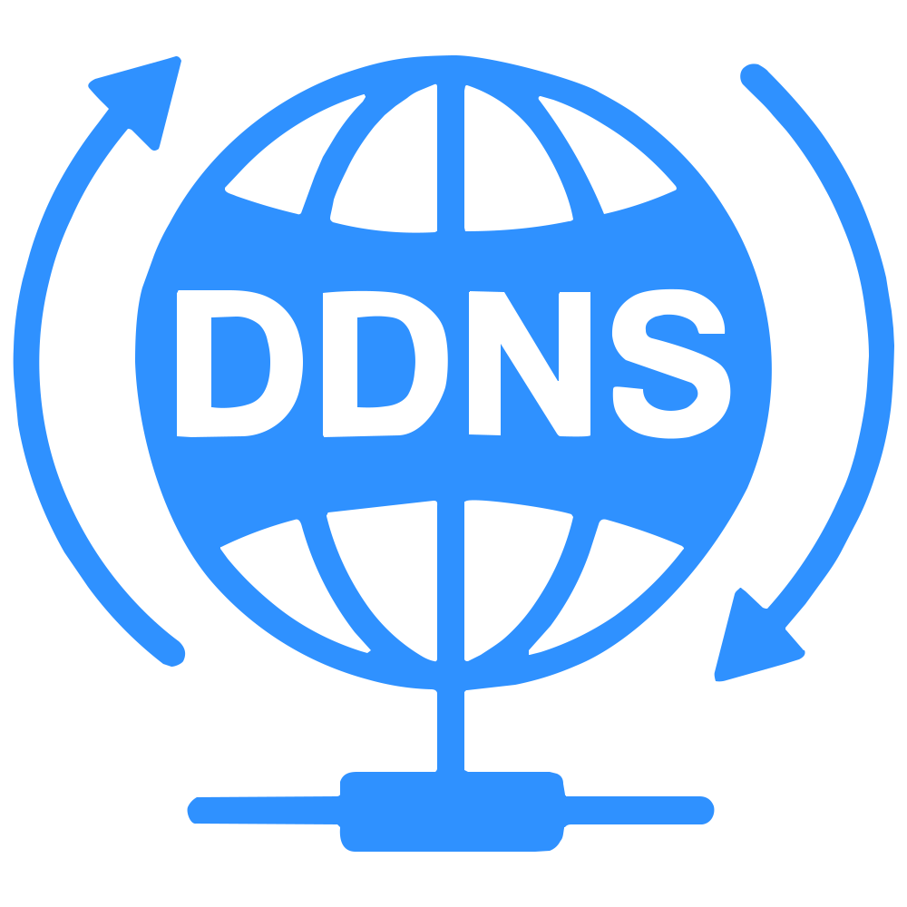

# [](https://ddns.newfuture.cc) DDNS

> 自动更新 DNS 解析到本机 IP 地址，支持 IPv4/IPv6，内网/公网 IP，自动创建 DNS 记录

[](https://github.com/NewFuture/DDNS)
[](https://github.com/NewFuture/DDNS/actions/workflows/build.yml)
[](https://github.com/NewFuture/DDNS/actions/workflows/publish.yml)
[](https://github.com/NewFuture/DDNS/releases/latest)
[](https://pypi.org/project/ddns/)
[](https://pypi.org/project/ddns/)
[](https://hub.docker.com/r/newfuture/ddns)
[](https://hub.docker.com/r/newfuture/ddns)

## 主要特性

### 🚀 多平台支持

- **Docker**: 推荐方式，支持 `amd64`、`arm64`、`arm/v7` 等多架构 ([使用文档](docs/docker.md))
- **二进制文件**: 单文件运行，支持 Windows/Linux/macOS ([下载地址](https://github.com/NewFuture/DDNS/releases/latest))
- **pip 安装**: `pip install ddns`
- **源码运行**: 无依赖，仅需 Python 环境

### ⚙️ 灵活配置

- **命令行参数**: `ddns --dns=dnspod --id=xxx --token=xxx` ([配置文档](docs/config/cli.md))
- **JSON 配置文件**: 支持多域名、多服务商配置，支持远程URL配置 ([配置文档](docs/config/json.md))
- **环境变量**: Docker 友好的配置方式 ([配置文档](docs/config/env.md))

### 🌍 DNS 服务商支持

支持 15+ 主流 DNS 服务商，包括：

- **国内**: [阿里DNS](docs/providers/alidns.md) ⚡、[阿里云ESA](docs/providers/aliesa.md) ⚡、[DNSPOD](docs/providers/dnspod.md)、[腾讯云DNS](docs/providers/tencentcloud.md) ⚡、[腾讯云EdgeOne](docs/providers/edgeone.md) ⚡、[华为云DNS](docs/providers/huaweidns.md) ⚡、[DNS.COM](docs/providers/51dns.md)
- **国际**: [Cloudflare](docs/providers/cloudflare.md)、[DNSPOD国际版](docs/providers/dnspod_com.md)、[HE.net](docs/providers/he.md)、[NameSilo](docs/providers/namesilo.md)、[No-IP](docs/providers/noip.md)
- **自定义**: [回调 API](docs/providers/callback.md)、[调试模式](docs/providers/debug.md)

> ⚡ 表示支持 HMAC-SHA256 企业级安全认证 | [查看所有服务商](docs/providers/)

### 🔧 高级功能

- 多域名和多级域名解析
- IPv4/IPv6 双栈支持
- 自动创建 DNS 记录
- 内网/公网 IP 自动检测
- HTTP 代理和多代理切换
- 本地缓存减少 API 调用
- [定时任务](docs/config/cli.md#task-management-定时任务管理)和日志管理

## 使用

### ① 安装

根据需要选择一种方式：`一键脚本`、`二进制`版、`pip`版、`源码`运行，或者 `Docker`。

推荐 Docker 版，兼容性最佳，体积小，性能优化。

- #### Docker（推荐）

  详细说明和高级用法请查看 [Docker 使用文档](docs/docker.md)

  <details>
  <summary markdown="span">支持命令行，配置文件，和环境变量传参</summary>

  - 命令行cli

      ```sh
      docker run newfuture/ddns -h
      ```

  - 使用配置文件（docker 工作目录 `/ddns/`，默认配置位置 `/ddns/config.json`）：

      ```sh
      docker run -d -v /host/config/:/ddns/ --network host newfuture/ddns
      ```

  - 使用环境变量：

      ```sh
      docker run -d \
        -e DDNS_DNS=dnspod \
        -e DDNS_ID=12345 \
        -e DDNS_TOKEN=mytokenkey \
        -e DDNS_IPV4=ddns.newfuture.cc \
        --network host \
        newfuture/ddns
      ```

  </details>

- #### 二进制版（单文件，无需 python）

  前往[release下载对应版本](https://github.com/NewFuture/DDNS/releases/latest)

  也可使用一键安装脚本自动下载并安装对应平台的二进制：

  ```bash
  curl -#fSL https://ddns.newfuture.cc/install.sh | sh
  ```
  提示：安装到系统目录（如 /usr/local/bin）可能需要 root 或 sudo 权限；若权限不足，可改为 `sudo sh` 运行。

  详细说明请查看 [一键安装文档](docs/install.md)

- #### pip 安装（需要 pip 或 easy_install）

  1. 安装 ddns: `pip install ddns` 或 `easy_install ddns`
  2. 运行: `ddns -h` 或者 `python -m ddns`

- #### 源码运行（无任何依赖，需 python 环境）

  1. clone 或者 [下载此仓库](https://github.com/NewFuture/DDNS/archive/master.zip) 并解压
  2. 运行 `python -m ddns`

### ② 快速配置

1. 申请 api `token`，填写到对应的 `id` 和 `token` 字段:

   - **DNSPOD(中国版)**: [创建 token](https://support.dnspod.cn/Kb/showarticle/tsid/227/) | [详细配置文档](docs/providers/dnspod.md)
   - **阿里云 DNS**: [申请 accesskey](https://help.aliyun.com/document_detail/87745.htm) | [详细配置文档](docs/providers/alidns.md)
   - **阿里云边缘安全加速(ESA)**: [申请 accesskey](https://help.aliyun.com/document_detail/87745.htm) | [详细配置文档](docs/providers/aliesa.md)
   - **51DNS(dns.com)**: [API Key/Secret](https://www.dns.com/member/apiSet) | [详细配置文档](docs/providers/51dns.md)
   - **DNSPOD(国际版)**: [获取 token](https://www.dnspod.com/docs/info.html#get-the-user-token) | [详细配置文档](docs/providers/dnspod_com.md)
   - **CloudFlare**: [API Key](https://support.cloudflare.com/hc/en-us/articles/200167836-Where-do-I-find-my-Cloudflare-API-key-)（除了 `email + API KEY`，也可使用 `Token`，**需要list Zone 权限**） | [详细配置文档](docs/providers/cloudflare.md)
   - **HE.net**: [DDNS 文档](https://dns.he.net/docs.html)（仅需将设置的密码填入 `token` 字段，`id` 字段可留空） | [详细配置文档](docs/providers/he.md)
   - **华为云 DNS**: [APIKEY 申请](https://console.huaweicloud.com/iam/)（点左边访问密钥，然后点新增访问密钥） | [详细配置文档](docs/providers/huaweidns.md)
   - **NameSilo**: [API Key](https://www.namesilo.com/account/api-manager)（API Manager 中获取 API Key） | [详细配置文档](docs/providers/namesilo.md)
   - **腾讯云 DNS**: [API Secret](https://console.cloud.tencent.com/cam/capi) | [详细配置文档](docs/providers/tencentcloud.md)
   - **腾讯云 EdgeOne**: [API Secret](https://console.cloud.tencent.com/cam/capi) | [详细配置文档](docs/providers/edgeone.md)
   - **No-IP**: [用户名和密码](https://www.noip.com/)（使用 No-IP 账户的用户名和密码） | [详细配置文档](docs/providers/noip.md)
   - **自定义回调**: 参数填写方式请查看下方的自定义回调配置说明

2. 修改配置文件，`ipv4` 和 `ipv6` 字段，为待更新的域名，详细参照配置说明

## 详细配置

所有字段可通过三种方式进行配置，优先级为：**命令行参数 > JSON配置文件 > 环境变量**

1. [命令行参数](docs/config/cli.md) `ddns --key=value`（`ddns -h` 查看详情），优先级最高
2. [JSON 配置文件](docs/config/json.md)（值为 null 认为是有效值，会覆盖环境变量的设置，如果没有对应的 key 则会尝试使用环境变量）
3. [环境变量](docs/config/env.md) DDNS_ 前缀加上 key （`${ddns_id}` 或 `${DDNS_ID}`，`${DDNS_LOG_LEVEL}`）

### 配置优先级和字段覆盖关系

如果同一个配置项在多个地方设置，将按照以下优先级规则生效：

- **命令行参数**：优先级最高，会覆盖其他所有设置
- **JSON配置文件**：介于命令行和环境变量之间，会覆盖环境变量中的设置
- **环境变量**：优先级最低，当其他方式未设置时使用

**高级用法**：

- JSON配置中明确设为`null`的值会覆盖环境变量设置
- `debug`参数只在命令行中有效，JSON配置文件中的同名设置无效
- 多值参数（如`ipv4`、`ipv6`等）在命令行中使用方式为重复使用参数，如`--ipv4 domain1 --ipv4 domain2`

各配置方式的详细说明请查看对应文档：[命令行](docs/config/cli.md)、[JSON配置](docs/config/json.md)、[环境变量](docs/config/env.md)、[服务商配置](docs/providers/)

> 📖 **环境变量详细配置**: 查看 [环境变量配置文档](docs/config/env.md) 了解所有环境变量的详细用法和示例

<details open>
<summary markdown="span">config.json 配置文件</summary>

- 首次运行会自动生成一个模板配置文件
- 可以使用 `-c` 使用指定的配置文件（默认读取当前目录的 config.json）
- 推荐使用 vscode 等支持 JsonSchema 的编辑器编辑配置文件
- 查看 [JSON配置文件详细文档](docs/config/json.md) 了解完整的配置选项和示例

```bash
ddns -c path/to/config.json
# 或者python运行
python -m ddns -c /path/to/config.json
# 远程配置文件
ddns -c https://ddns.newfuture.cc/tests/config/debug.json
```

#### 配置参数表

|        key         |        type        | required |   default   |            description            | tips                                                                                                                                                                                                                                                                                                                                                   |
|:------------------:|:------------------:|:--------:|:-----------:|:---------------------------------:|--------------------------------------------------------------------------------------------------------------------------------------------------------------------------------------------------------------------------------------------------------------------------------------------------------------------------------------------------------|
|         id         |       string       |    √     |     无      |            api 访问 ID            | Cloudflare 为邮箱（使用 Token 时留空）<br>HE.net 可留空<br>华为云为 Access Key ID (AK)                                                                                                                                                                                                                                                                 |
|       token        |       string       |    √     |     无      |          api 授权 token           | 部分平台叫 secret key，**反馈粘贴时删除**                                                                                                                                                                                                                                                                                                              |
|        dns         |       string       |    No    | `"dnspod"`  |            dns 服务商             | 阿里 DNS 为 `alidns`，阿里ESA为 `aliesa`，Cloudflare 为 `cloudflare`，dns.com 为 `dnscom`，DNSPOD 国内为 `dnspod`，DNSPOD 国际为 `dnspod_com`，HE.net 为 `he`，华为云为 `huaweidns`，NameSilo 为 `namesilo`，腾讯云为 `tencentcloud`，腾讯云EdgeOne为 `edgeone`，No-IP 为 `noip`，自定义回调为 `callback`。部分服务商有[详细配置文档](docs/providers/) |
|        ipv4        |       array        |    No    |    `[]`     |           ipv4 域名列表           | 为 `[]` 时，不会获取和更新 IPv4 地址                                                                                                                                                                                                                                                                                                                   |
|        ipv6        |       array        |    No    |    `[]`     |           ipv6 域名列表           | 为 `[]` 时，不会获取和更新 IPv6 地址                                                                                                                                                                                                                                                                                                                   |
|       index4       | string\|int\|array |    No    | `"default"` |           ipv4 获取方式           | 可设置 `网卡`、`内网`、`公网`、`正则` 等方式                                                                                                                                                                                                                                                                                                           |
|       index6       | string\|int\|array |    No    | `"default"` |           ipv6 获取方式           | 可设置 `网卡`、`内网`、`公网`、`正则` 等方式                                                                                                                                                                                                                                                                                                           |
|        ttl         |       number       |    No    |   `null`    |         DNS 解析 TTL 时间         | 不设置采用 DNS 默认策略                                                                                                                                                                                                                                                                                                                                |
|       proxy        |   string\|array    |    No    |     无      | HTTP 代理格式：`http://host:port` | 多代理逐个尝试直到成功，`DIRECT` 为直连                                                                                                                                                                                                                                                                                                                |
|        ssl         |  string\|boolean   |    No    |  `"auto"`   |          SSL证书验证方式          | `true`（强制验证）、`false`（禁用验证）、`"auto"`（自动降级）或自定义CA证书文件路径                                                                                                                                                                                                                                                                    |
|       debug        |        bool        |    No    |   `false`   |           是否开启调试            | 调试模式，仅命令行参数`--debug`有效                                                                                                                                                                                                                                                                                                                    |
|       cache        |    string\|bool    |    No    |   `true`    |           是否缓存记录            | 正常情况打开避免频繁更新，默认位置为临时目录下 `ddns.cache`，也可以指定一个具体路径                                                                                                                                                                                                                                                                    |
| cache_verify_every |      integer       |    No    |     `0`     |     缓存命中后按次数强制校验      | 本地 IP 未变化时，连续命中缓存多少次后强制向上游校验一次                                                                                                                                                                                                                                                                                               |
|        log         |       object       |    No    |   `null`    |         日志配置（可选）          | 日志配置对象，支持`level`、`file`、`format`、`datefmt`参数                                                                                                                                                                                                                                                                                             |

#### index4 和 index6 参数说明

- 数字（`0`，`1`，`2`，`3`等）：第 i 个网卡 ip
- 字符串 `"default"`（或者无此项）：系统访问外网默认 IP
- 字符串 `"public"`：使用公网 ip（使用公网 API 查询，url 的简化模式）
- 字符串 `"url:xxx"`：打开 URL `xxx`（如：`"url:http://ip.sb"`），从返回的数据提取 IP 地址
- 字符串 `"regex:xxx"` 正则表达（如 `"regex:192.*"`）：提取 `ifconfig`/`ipconfig` 中与之匹配的首个 IP 地址，**注意 json 转义**（`\`要写成`\\`）
  - `"192.*"` 表示 192 开头的所有 ip（注意 `regex:` 不可省略）
  - 如果想匹配 `10.00.xxxx` 应该写成 `"regex:10\\.00\\..*"`（`"\\"` json 转义成 `\`）
- 字符串 `"cmd:xxxx"`：执行命令 `xxxx` 的 stdout 输出结果作为目标 IP
- 字符串 `"shell:xxx"`：使用系统 shell 运行 `xxx`，并把结果 stdout 作为目标 IP
- `false`：强制禁止更新 ipv4 或 ipv6 的 DNS 解析
- 列表：依次执行列表中的 index 规则，并将最先获得的结果作为目标 IP
  - 例如 `["public", "regex:172\\..*"]` 将先查询公网 API，未获取到 IP 后再从本地寻找 172 开头的 IP

#### 自定义回调配置说明

- `id` 字段填写回调地址，以 HTTP 或 HTTPS 开头，推荐采用 HTTPS 方式的回调 API，支持变量替换功能。
- `token` 字段为 POST 请求参数（JSON对象或JSON字符串），本字段为空或不存在则使用 GET 方式发起回调。当 JSON 的参数值包含下表所示的常量字符串时，会自动替换为实际内容。

详细配置指南请查看：[Callback Provider 配置文档](docs/providers/callback.md)

| 常量名称         | 常量内容                 | 说明     |
| ---------------- | ------------------------ | -------- |
| `__DOMAIN__`     | DDNS 域名                |          |
| `__IP__`         | 获取的对应类型的 IP 地址 |          |
| `__RECORDTYPE__` | DDNS 记录类型            |          |
| `__TTL__`        | DDNS TTL                 |          |
| `__TIMESTAMP__`  | 请求发起时间戳           | 包含小数 |

#### 配置示例

```json
{
  "$schema": "https://ddns.newfuture.cc/schema/v4.1.json",
  "id": "12345",
  "token": "mytokenkey",
  "dns": "dnspod 或 dnspod_com 或 alidns 或 aliesa 或 dnscom 或 cloudflare 或 he 或 huaweidns 或 namesilo 或 tencentcloud 或 noip 或 callback",
  "ipv4": ["ddns.newfuture.cc", "ipv4.ddns.newfuture.cc"],
  "ipv6": ["ddns.newfuture.cc", "ipv6.ddns.newfuture.cc"],
  "index4": 0,
  "index6": "public",
  "ttl": 600,
  "proxy": ["http://127.0.0.1:1080", "DIRECT"],
  "log": {
    "level": "DEBUG",
    "file": "dns.log",
    "datefmt": "%Y-%m-%dT%H:%M:%S"
  }
}
```

</details>

## 🌐 路由器/光猫用户？

如果您的路由器或光猫仅支持传统 DDNS 协议，但想使用现代 DNS 服务商，可以使用 **[edge-ddns-proxy](https://github.com/NewFuture/edge-ddns-proxy)** 实现协议转换。

---

## 定时任务

<details>
<summary markdown="span">使用内置的 task 命令设置定时任务（默认每 5 分钟检查一次 IP，自动更新）</summary>

DDNS 提供内置的 `task` 子命令来管理定时任务，支持跨平台自动化部署：

### 高级管理

```bash
# 安装并指定更新间隔（分钟）
ddns task --install 10 -c /etc/config/ddns.json

# 启用/禁用任务
ddns task --enable
ddns task --disable
```

详细配置指南请参考：[命令行参数文档](docs/config/cli.md#task-management-定时任务管理)

### Docker

Docker 镜像在无额外参数的情况下，已默认启用每 5 分钟执行一次的定时任务

</details>

<details>
<summary markdown="span">问题排查反馈</summary>

1. 先确认排查是否是系统/网络环境问题
2. 在 [issues](https://github.com/NewFuture/DDNS/issues) 中搜索是否有类似问题
3. 前两者均无法解决或者确定是 bug，[在此新建 issue](https://github.com/NewFuture/DDNS/issues/new)
   - [ ] 开启 `--debug`
   - [ ] 附上这些内容 **运行版本和方式**、**系统环境**、**出错日志**、**去掉 id/token** 的配置文件
   - [ ] 源码运行注明使用的 python 环境

</details>
